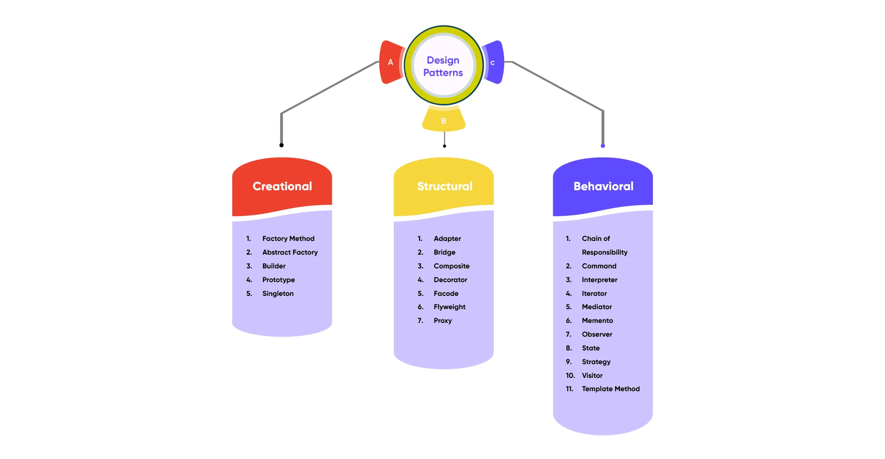

# What is Design-pattern ?

In software engineering, a design pattern is a general, reusable solution of how to solve a common problem when designing an application or system.

# Types of the design pattern

There are three main types of design patterns :-

1. Creational
2. Structural
3. Behavioural

